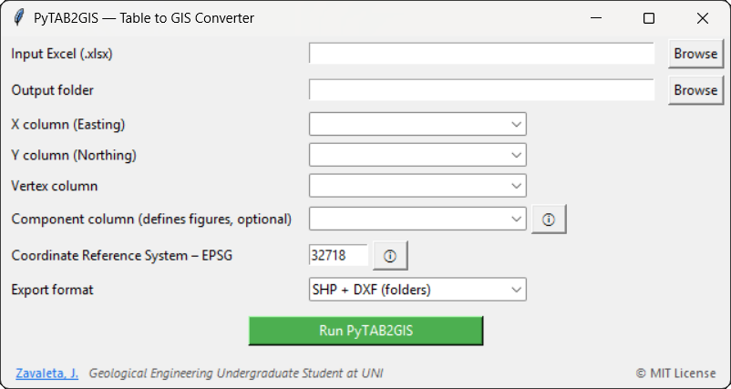

# PyTAB2GIS


**PyTAB2GIS** is a lightweight desktop application that converts structured Excel tables into GIS-ready vector formats such as **Shapefile (SHP)** and **DXF**.

It is designed for **geological, environmental, and engineering workflows**, where spatial data are commonly provided in tabular form (e.g. survey coordinates, field measurements, technical reports) and must be transformed into valid GIS geometries quickly and reliably.

PyTAB2GIS provides a **graphical user interface (GUI)** and requires **no programming knowledge**, making it suitable for both academic and professional use.

---

## ✨ Key Features

- Import spatial data directly from Excel files (`.xlsx`)
- Automatic geometry construction from coordinate tables:
  - **Polygons** (≥ 3 vertices)
  - **Lines** (2 vertices)
- Support for:
  - Single-feature tables
  - Multiple features using a component/grouping column
- Robust handling of:
  - Merged cells
  - Empty or partially filled rows
- Explicit **Coordinate Reference System (CRS)** definition using EPSG codes
- Export formats:
  - ESRI Shapefile (SHP)
  - DXF (AutoCAD-compatible)
- Clean and minimal desktop GUI
- Standalone Windows executable available

---

## 🧭 Typical Use Cases

- Geological and structural mapping
- Mining and exploration projects
- Environmental and geotechnical studies
- Engineering layouts derived from survey tables
- Academic GIS exercises and teaching
- Rapid preprocessing of spatial datasets for QGIS, ArcGIS, or AutoCAD

---

## 🖥️ Graphical Interface Workflow

Using PyTAB2GIS through the GUI involves the following steps:

1. Select an Excel file containing coordinate data
2. Choose the corresponding columns for:
   - X (Easting)
   - Y (Northing)
   - Vertex order
   - Optional component/group column
3. Specify the Coordinate Reference System using an EPSG code
4. Select the desired export format
5. Run the conversion and generate GIS-ready files

The resulting files can be opened directly in standard GIS or CAD software.

---

## 📦 Standalone Executable (Windows)

A precompiled Windows executable is provided in the **Releases** section of this repository.

- No Python or Conda installation required
- All dependencies are bundled
- Simply download, extract, and run `PyTAB2GIS.exe`

This option is recommended for end users who only need the tool, not the source code.

---

## 🧑‍💻 Running from Source (Optional)

For users who wish to run or extend the source code:

```bash
git clone https://github.com/jordan-zav/PyTAB2GIS
cd PyTAB2GIS
python -m pytab2gis.gui.main_gui
A Conda-based environment is recommended due to GIS dependencies.

📁 Project Structure
text
Copiar código
pytab2gis/
├─ config/      # Configuration models
├─ core/        # Main processing pipelines
├─ crs/         # Coordinate reference system handling
├─ export/      # SHP and DXF exporters
├─ figures/     # Geometry construction logic
├─ geometry/    # Geometry validation and checks
├─ gui/         # Tkinter-based GUI
├─ io/          # Excel readers and input handling
├─ table/       # Table utilities
├─ utils/       # Helper functions
├─ __init__.py
└─ cli.py       # Command-line entry point (future use)
The modular design separates GUI logic, data processing, geometry handling, and export routines to ensure maintainability and extensibility.

⚖️ License
This project is released under the MIT License.

You are free to:

Use the software

Modify it

Integrate it into larger pipelines

Redistribute it, including for commercial purposes

A non-binding citation request is included in the LICENSE file for academic and technical use.

👤 Author
Jordan Zavaleta
Geological Engineering Undergraduate Student
Universidad Nacional de Ingeniería (UNI), Peru

📧 Contact: jordanzr10@gmail.com

📌 Disclaimer
This software is provided as is, without warranty of any kind.
Users are responsible for validating results before applying them in academic, professional, or legal contexts.
