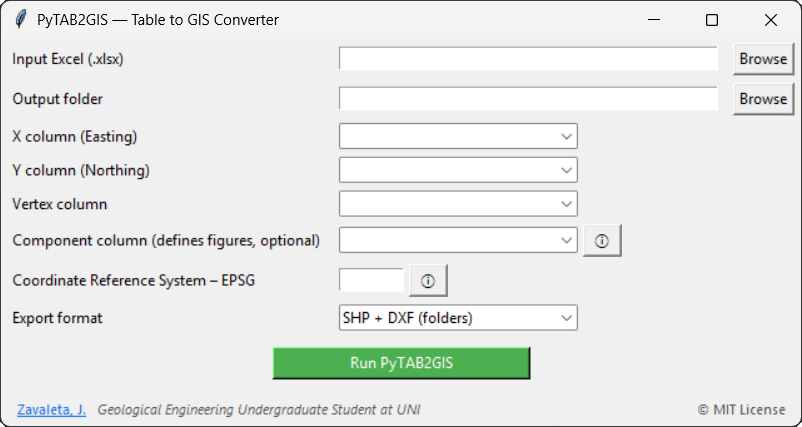

<div align="center">

# PyTAB2GIS

**Turn coordinate tables into auditable GIS polygon deliverables**

Convert semi-structured Excel worksheets used in mining, environmental and
engineering projects into explicitly referenced SHP, GeoPackage and optional
DXF outputs.

[](#project-status)
[](https://github.com/jordan-zav/PyTAB2GIS/releases/latest)
[](https://www.python.org/)
[](LICENSE.txt)

</div>

> [!IMPORTANT]
> PyTAB2GIS never guesses a coordinate reference system. The operator must
> provide the EPSG code or another explicit CRS definition and verify the
> resulting geometry against the source document.

<p align="center">
  
</p>

## Workflow at a glance

```text
Excel workbook / coordinate table
               │
               ▼
 Sheet and column selection ──► table normalization
               │
               ▼
 Figure grouping ──► vertex ordering ──► polygon validation
               │
               ▼
 Explicit source CRS ──► SHP / GeoPackage / optional DXF
               │
               ▼
       Optional per-figure ZIP delivery packages
```

## Capabilities

| Area | Current support |
| --- | --- |
| Input | Excel `.xlsx` worksheets with coordinate and vertex columns |
| Table handling | Column selection, multiple sheets, empty/merged-cell normalization and optional component grouping |
| Geometry | Polygon construction, closure and basic validity checks |
| CRS | Required user-supplied EPSG code; no silent CRS inference |
| GIS export | ESRI Shapefile and GeoPackage |
| CAD exchange | Optional DXF export when the installed GDAL build provides the driver |
| Delivery | Optional ZIP packages containing the sidecar files for each Shapefile |
| Interfaces | Tkinter desktop interface; command-line code remains under stabilization |

## Expected table structure

At minimum, the operator maps columns representing:

- easting or X coordinate;
- northing or Y coordinate;
- vertex order; and
- an optional component/figure name used to separate polygons.

Example:

| COMPONENT | VERTEX | EASTING | NORTHING |
| --- | ---: | ---: | ---: |
| Stockpile A | 1 | 356120.4 | 8665032.8 |
| Stockpile A | 2 | 356181.2 | 8665040.1 |
| Stockpile A | 3 | 356176.9 | 8664979.5 |

Coordinate values, units and CRS remain the responsibility of the source
document and the operator. A geometrically valid polygon can still be located
incorrectly if its CRS is wrong.

## Installation

For a reproducible geospatial environment, Conda/Miniforge is recommended
because GDAL, Fiona and GeoPandas include compiled native dependencies.

```powershell
git clone https://github.com/jordan-zav/PyTAB2GIS.git
cd PyTAB2GIS
python -m venv .venv
.\.venv\Scripts\Activate.ps1
python -m pip install --upgrade pip
python -m pip install -r requirements.txt
python -m pip install -e .
```

Tesseract is only required for experimental image/OCR work. It is not required
for ordinary Excel conversion.

## Run the desktop interface

```powershell
python -m pytab2gis.gui.main_gui
```

In the interface:

1. select the workbook and output directory;
2. map X, Y, vertex and component columns;
3. enter the source EPSG code;
4. choose SHP or GeoPackage and optional DXF/ZIP; and
5. inspect the outputs in QGIS before delivery.

## Outputs and audit checks

| Output | Verification |
| --- | --- |
| Shapefile | Keep `.shp`, `.shx`, `.dbf`, `.prj` and related sidecars together |
| GeoPackage | Open the polygon layer and verify its declared CRS and extent |
| DXF | Confirm units and layer placement in the receiving CAD application |
| ZIP | Reopen the archive and confirm that every required sidecar is present |

Recommended checks include vertex order, self-intersection, minimum area,
unexpected multipart geometry, extent, units and overlay against a trusted
reference layer.

## Repository map

| Path | Contents |
| --- | --- |
| `pytab2gis/io` | Workbook and experimental image readers |
| `pytab2gis/table` | Table and column detection/normalization |
| `pytab2gis/figures` | Figure grouping and geometry checks |
| `pytab2gis/geometry` | Polygon construction and validation |
| `pytab2gis/crs` | Explicit CRS definitions and presets |
| `pytab2gis/export` | SHP, GeoPackage, DXF and ZIP output logic |
| `pytab2gis/gui` | Tkinter desktop interface |
| `docs` | Architecture notes, screenshot and paper outline |
| `tests` | Example workbooks and image fixtures |

## Project status

The repository contains an initial public prototype and a v1.0.0 release. The
desktop Excel workflow is the current documented path. The CLI entry point and
automated regression suite need consolidation before a new stable release, and
the package metadata still uses the provisional version `0.0.0`.

## License and contact

The open-source code is distributed under the GNU General Public License v3.0;
see [LICENSE.txt](LICENSE.txt). Commercial licensing enquiries can be sent to:

Jordan Zavaleta — GisGeo Dev<br>
[jordanzav@gisgeo.dev](mailto:jordanzav@gisgeo.dev) · [gisgeo.dev](https://gisgeo.dev)
